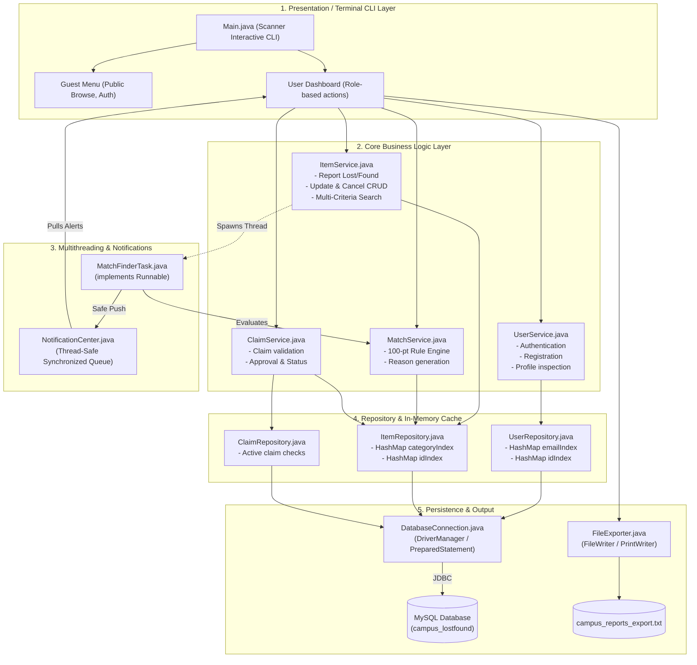

# System Architecture Diagram

This diagram represents the actual 4-tier architectural structure of the **Campus Lost and Found System**.

---

## Architecture Components

1. **Presentation Layer (`campus.lostfound.Main`)**: Handles terminal input parsing, menu navigation, and input validation without external UI libraries.
2. **Business Service Layer (`campus.lostfound.service.*`)**: Encapsulates domain logic, validation rules, 100-point matching calculations, and claim transitions.
3. **Concurrency Layer (`campus.lostfound.util.*`)**: Asynchronously evaluates match candidates upon item creation and stores alerts in a thread-safe synchronized queue.
4. **Data Access Layer (`campus.lostfound.repository.*`)**: Coordinates JDBC queries with in-memory HashMap indices for fast lookups.
5. **Persistence Layer**: Relational MySQL database backed by `DatabaseConnection` with zero-crash in-memory fallback.
