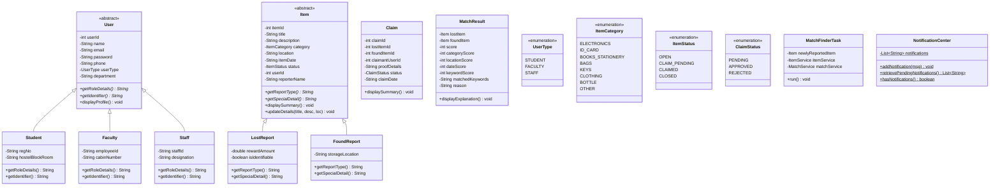

# UML Class Diagram

This diagram documents the actual class hierarchy, relationships, inheritance, and polymorphism implemented in `campus.lostfound.*`.

```mermaid
classDiagram
    %% Model Layer
    class User {
        <<abstract>>
        -int userId
        -String name
        -String email
        -String password
        -String phone
        -UserType userType
        -String department
        +getRoleDetails()* String
        +getIdentifier()* String
        +displayProfile() void
    }

    class Student {
        -String regNo
        -String hostelBlockRoom
        +getRoleDetails() String
        +getIdentifier() String
    }

    class Faculty {
        -String employeeId
        -String cabinNumber
        +getRoleDetails() String
        +getIdentifier() String
    }

    class Staff {
        -String staffId
        -String designation
        +getRoleDetails() String
        +getIdentifier() String
    }

    User <|-- Student
    User <|-- Faculty
    User <|-- Staff

    class Item {
        <<abstract>>
        -int itemId
        -String title
        -String description
        -ItemCategory category
        -String location
        -String itemDate
        -ItemStatus status
        -int userId
        -String reporterName
        +getReportType()* String
        +getSpecialDetail()* String
        +displaySummary() void
        +updateDetails(title, desc, loc) void
    }

    class LostReport {
        -double rewardAmount
        -boolean isIdentifiable
        +getReportType() String
        +getSpecialDetail() String
    }

    class FoundReport {
        -String storageLocation
        +getReportType() String
        +getSpecialDetail() String
    }

    Item <|-- LostReport
    Item <|-- FoundReport

    class Claim {
        -int claimId
        -int lostItemId
        -int foundItemId
        -int claimantUserId
        -String proofDetails
        -ClaimStatus status
        -String claimDate
        +displaySummary() void
    }

    class MatchResult {
        -Item lostItem
        -Item foundItem
        -int score
        -int categoryScore
        -int locationScore
        -int dateScore
        -int keywordScore
        -String matchedKeywords
        -String reason
        +displayExplanation() void
    }

    %% Enums
    class UserType {
        <<enumeration>>
        STUDENT
        FACULTY
        STAFF
    }

    class ItemCategory {
        <<enumeration>>
        ELECTRONICS
        ID_CARD
        BOOKS_STATIONERY
        BAGS
        KEYS
        CLOTHING
        BOTTLE
        OTHER
    }

    class ItemStatus {
        <<enumeration>>
        OPEN
        CLAIM_PENDING
        CLAIMED
        CLOSED
    }

    class ClaimStatus {
        <<enumeration>>
        PENDING
        APPROVED
        REJECTED
    }

    %% Services & Concurrency
    class MatchFinderTask {
        -Item newlyReportedItem
        -ItemService itemService
        -MatchService matchService
        +run() void
    }

    class NotificationCenter {
        -List~String~ notifications$
        +addNotification(msg)$ void
        +retrievePendingNotifications()$ List~String~
        +hasNotifications()$ boolean
    }
```
