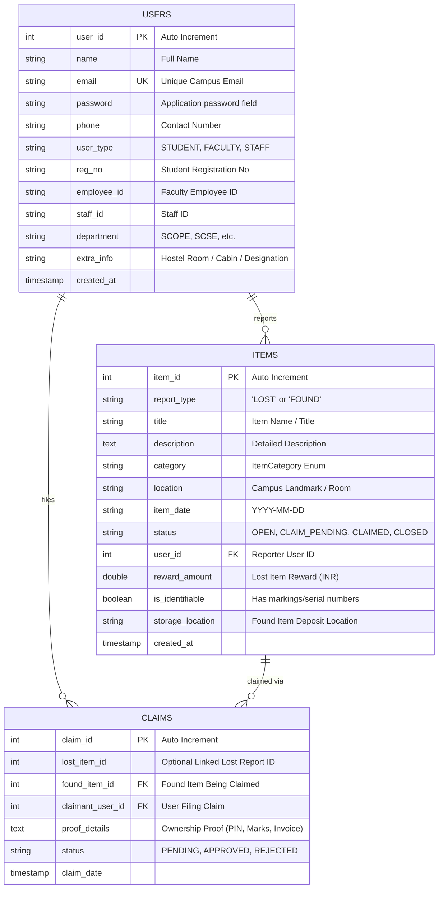

# Entity-Relationship (ER) Diagram

This diagram documents the relational schema implemented in `schema.sql` and manipulated via JDBC PreparedStatements.

```mermaid
erDiagram
    USERS ||--o{ ITEMS : reports
    USERS ||--o{ CLAIMS : files
    ITEMS ||--o{ CLAIMS : "claimed via"

    USERS {
        int user_id PK "Auto Increment"
        string name "Full Name"
        string email UK "Unique Campus Email"
        string password "Application password field"
        string phone "Contact Number"
        string user_type "STUDENT, FACULTY, STAFF"
        string reg_no "Student Registration No"
        string employee_id "Faculty Employee ID"
        string staff_id "Staff ID"
        string department "SCOPE, SCSE, etc."
        string extra_info "Hostel Room / Cabin / Designation"
        timestamp created_at
    }

    ITEMS {
        int item_id PK "Auto Increment"
        string report_type "'LOST' or 'FOUND'"
        string title "Item Name / Title"
        text description "Detailed Description"
        string category "ItemCategory Enum"
        string location "Campus Landmark / Room"
        string item_date "YYYY-MM-DD"
        string status "OPEN, CLAIM_PENDING, CLAIMED, CLOSED"
        int user_id FK "Reporter User ID"
        double reward_amount "Lost Item Reward (INR)"
        boolean is_identifiable "Has markings/serial numbers"
        string storage_location "Found Item Deposit Location"
        timestamp created_at
    }

    CLAIMS {
        int claim_id PK "Auto Increment"
        int lost_item_id "Optional Linked Lost Report ID"
        int found_item_id FK "Found Item Being Claimed"
        int claimant_user_id FK "User Filing Claim"
        text proof_details "Ownership Proof (PIN, Marks, Invoice)"
        string status "PENDING, APPROVED, REJECTED"
        timestamp claim_date
    }
```
