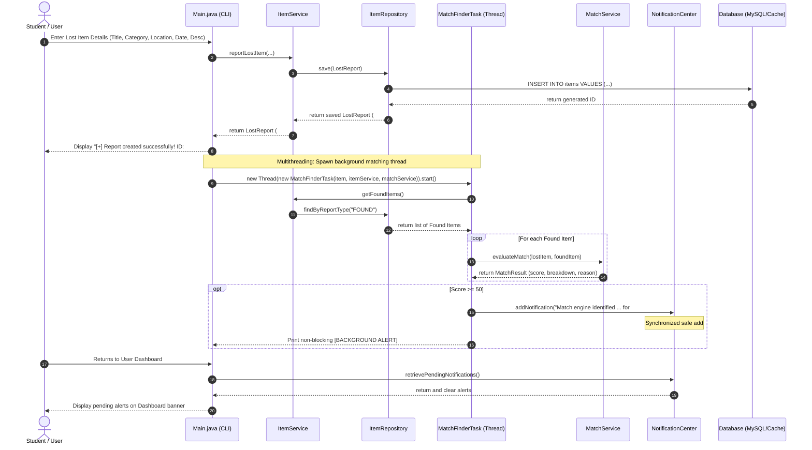

# Sequence Diagram: Lost Item Reporting & Background Match Flow

This sequence diagram depicts the interaction between the user, CLI, service layer, background thread, match engine, and notification queue.

