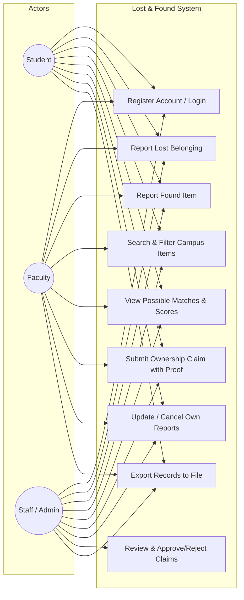

# Use Case Diagram

This diagram depicts system interactions for the three primary actors: **Student**, **Faculty**, and **Campus Staff**.

---

## Use Case Descriptions

- **UC1 (Register / Login)**: Authenticate or create role-specific profiles (Student regNo, Faculty empId, Staff staffId).
- **UC2 (Report Lost Belonging)**: Input title, description, category, location, date, reward amount, and unique markings.
- **UC3 (Report Found Item)**: Input title, description, category, location, date, and secure storage location.
- **UC4 (Search Items)**: Search via keywords or multi-criteria filters (Category, Location, Date, Status).
- **UC5 (View Possible Matches)**: Inspect 100-point algorithm breakdown and reasons.
- **UC6 (Submit Ownership Claim)**: Provide verifiable proof (PIN, invoice, marks) to request an item.
- **UC7 (Update / Cancel Reports)**: Edit details or close active reports created by the logged-in user.
- **UC8 (Review & Approve/Reject Claims)**: Handled by the finder or administrative staff to mark items as `CLAIMED`.
- **UC9 (Export Records)**: Generate an offline text file log of all items and claim records.
