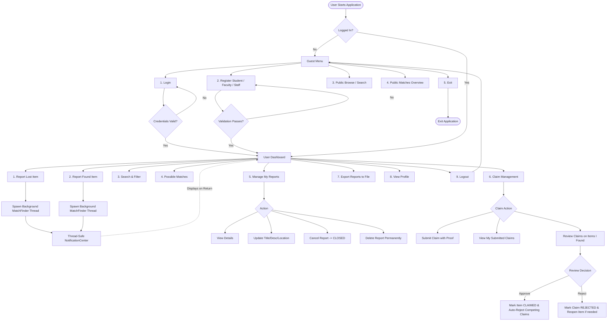

# Workflow Diagram

This diagram maps the user lifecycle through the **Campus Lost and Found System**.

```mermaid
flowchart TD
    Start([User Starts Application]) --> Menu{Logged In?}
    
    Menu -- No --> Guest[Guest Menu]
    Guest --> G1[1. Login]
    Guest --> G2[2. Register Student / Faculty / Staff]
    Guest --> G3[3. Public Browse / Search]
    Guest --> G4[4. Public Matches Overview]
    Guest --> G5[5. Exit]

    G1 --> AuthSuccess{Credentials Valid?}
    AuthSuccess -- Yes --> Dash[User Dashboard]
    AuthSuccess -- No --> G1
    G2 --> RegSuccess{Validation Passes?}
    RegSuccess -- Yes --> Dash
    RegSuccess -- No --> G2

    Menu -- Yes --> Dash

    Dash --> D1[1. Report Lost Item]
    Dash --> D2[2. Report Found Item]
    Dash --> D3[3. Search & Filter]
    Dash --> D4[4. Possible Matches]
    Dash --> D5[5. Manage My Reports]
    Dash --> D6[6. Claim Management]
    Dash --> D7[7. Export Reports to File]
    Dash --> D8[8. View Profile]
    Dash --> D9[9. Logout]

    D1 --> SpawnThread1[Spawn Background MatchFinder Thread]
    D2 --> SpawnThread2[Spawn Background MatchFinder Thread]
    SpawnThread1 --> SafeQueue[Thread-Safe NotificationCenter]
    SpawnThread2 --> SafeQueue
    SafeQueue -.->|Displays on Return| Dash

    D5 --> EditChoice{Action}
    EditChoice --> E1[View Details]
    EditChoice --> E2[Update Title/Desc/Location]
    EditChoice --> E3[Cancel Report -> CLOSED]
    EditChoice --> E4[Delete Report Permanently]

    D6 --> ClaimChoice{Claim Action}
    ClaimChoice --> C1[Submit Claim with Proof]
    ClaimChoice --> C2[View My Submitted Claims]
    ClaimChoice --> C3[Review Claims on Items I Found]
    C3 --> ApproveReject{Review Decision}
    ApproveReject -- Approve --> MarkClaimed[Mark Item CLAIMED & Auto-Reject Competing Claims]
    ApproveReject -- Reject --> MarkRejected[Mark Claim REJECTED & Reopen Item if needed]

    D9 --> Guest
    G5 --> End([Exit Application])
```
